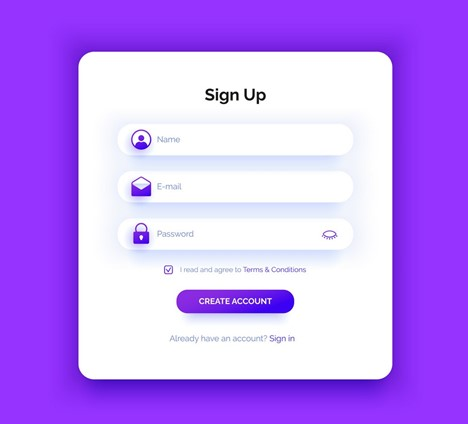
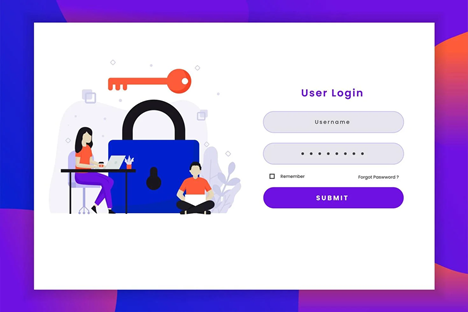

# RFP - Bearcat Study Buddy

## Statement of Purpose :
We would like to build a tool which is student friendly web application where it would help students to have an exact overview of the class tasks, it encourages students to complete all the tasks on time by providing to-do lists as well as memo functionality and it would help in displaying in due date for exams, assignments etc. This application will provide the student calendar visualized for all the tasks for the users. This app even provides us with a flexibility to select his own choice of themes.

## Vision

* We would like to create the progressive web application in which upon by clicking the application we will be directed into the screen where it will get displayed two options sign up and sign in.

* If we have new students, they need to create the profile newly by clicking sign up. Existing students can login using sign in option.    

* In login of the existing  student users, we will include the two-factor authentication with User id and mobile number. For mobile number authentication we will receive verification code to our mobile after entering the phone number.   

* Upon existing student login, it will have a pop-up to upload the schedule.

* After student loging in it will display grid view of courses the student registered and on the left side of the page it will display notifications of all the events happening in and around the classes. On the right side the student can find a to-do list and memo functionality which will encourage them to complete task on time. 

* The students can also check their due dates, upcoming events, class schedules in their calendar which would be an option inside the application.

* We are providing the chat option inside the application so that students can interact with the Professors as well as students.

* We are providing the additional options for students to change choice of themes according to their choice.

## Functional Requirements:

This tool would be a progressive web application with with authentication and authorization. The following roles are suggested:

* Student User Login

As a Student User,The following are responsibilites to include:

1) New student User must create the user profile to use the application by sign-up option.
2) Existing student users must login with userid,password and two factor login authentication.
3) The student users will have a option to upload the schedule of their classes.
4) This application visualizes the grid view of courses assigned to the student.
5) This application helps in visualizing the upcoming assignments,events for a specific class.
6) Student can view to-do notifications and memo functionality of the classes.
7) Students will provided with chat option to communicate with other students and professors.
8) Students can select their own choice of themes based on their visualization with the option provided.

 The app must work on:

 * an iPhone SE
	
* an Android device
	
* a laptop computer
	
* an iPad

## Bidder Qualifications:

Teams submitting RFP bids must be able to:

1.Give details about the project.

2.Before we begin, we will discuss and clarify matters with our acting client.

3.Implement functionality according to the contract's timelines.

4.For collaboration, use professional tools.

5.Use professional project management and tracking software.

6.In person, communicate professionally.

7.Communicate professionally remotely .

## Performance Metrics:

Performance will be assessed based on on-time deliverables without any bugs.

## Schedule:

* Module 1: Initial Planning
* Module 2: User Interface Design
* Module 3-6: Execution, Monitoring, and Controling
* Module 7: Release

## Project Definition and Planning 

Bearcat study buddy will allow students to input classes schedule, and access their courses. The app also provides access to course calendars, To Do items, notifications, and allows to interact with fellow students. 

The proposal will specify:
* Purpose
* Overview
* User Stories
* Functional Requirements
* UI Sketches
* Schedule
* Scope
* Budget
* Deliverables
* Risk Assessment

## Evaluation Criteria

The client will validate all the possible scenarios with the below features.

1)User friendly interface.

2)Schedule correctly reflected in calendar.

3)Checking the student can receive the updated notifications.

4)Verification of chat option is properly working and whether the student is able to communicate with professors and students.

## Theme/Layout/Mobile First :

 	
  

